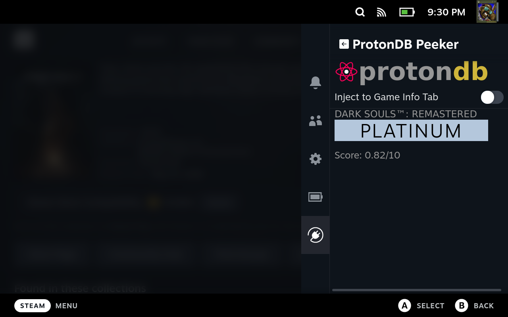
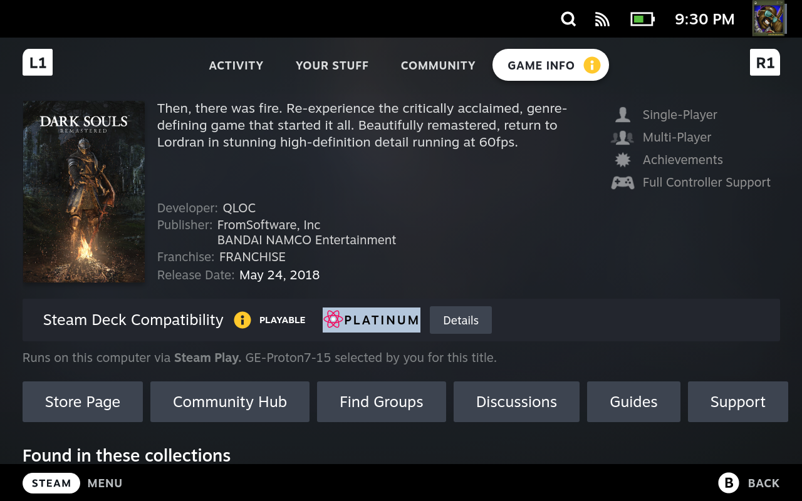

# ProtonDB Peeker

This is a plugin for the [SteamOS Plugin Loader](https://github.com/SteamDeckHomebrew/PluginLoader).

## Features

Displays current ProtonDB Tier, and score of the selected game in the Plugin View

Optionally can inject the ProtonDB Tier next to the Steam Deck Compatibility Icon under Game Info tab

I plan on expanding on the features, but not until the new version of the Plugin Loader is released.

## Installation
Clone / Unzip into ~/homebrew/plugins folder

Note: It _might_ require an unpacked version of the PluginService, this [gist](https://gist.github.com/neonoxd/4e060240ad61bb5135116c88824f8e9a) can help you in that

## Disclaimer
I am in no way associated with ProtonDB, This plugin consumes the api that the website already provides

The plugin creates the following directory `~/.config/pdbp`

Some form of caching is also implemented, the API is not called unless the cache is older than a day, this basically prevents from asking for the same data twice

The cache directory can be found here: `~/.config/pdbp/cache`

The plugin logs to `~/pdb.log`, I'll probably change this in the future

You can reach me on the Steam Deck Homebrew discord